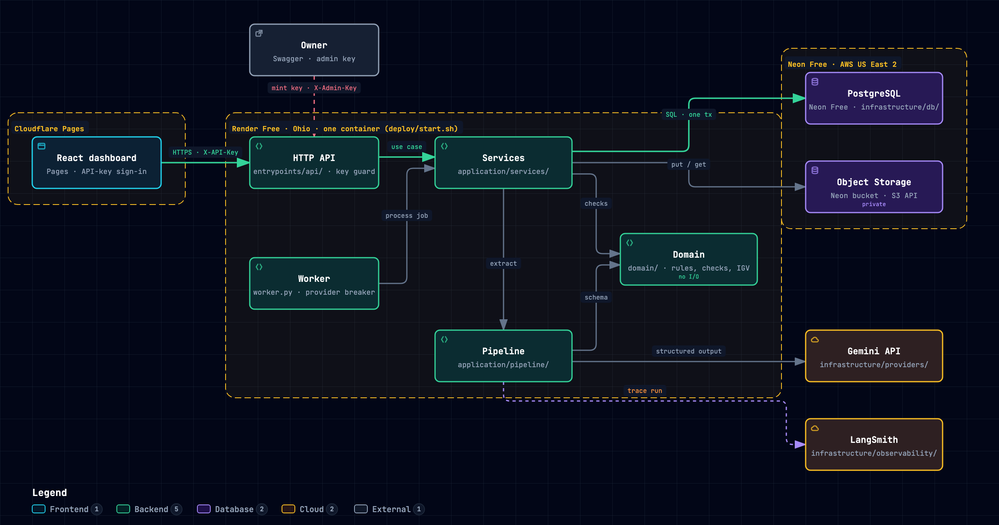

# Contacompa dashboard

React dashboard where an accountant uploads Peruvian purchase documents, reviews what the model extracted, corrects it, and exports it to Excel.

<!-- demo GIF placeholder: assets/demo.gif, record it after the first live run -->

## Overview

The dashboard is the accountant's side of Contacompa. They sign in with a company API key, upload PDFs or photos, follow the extraction jobs, and review the purchase records the model produced: only flagged records need attention, the original file sits next to the data, and corrections are one form away. A costs page shows what the model spends. English by default, Spanish written natively for a Peruvian accountant, light and dark themes.

The live URL opens on a public Home page that explains Contacompa without a key: how it works in four steps, the architecture diagram and stack, and links to both repositories. Its main button reads "Sign in", or "Open dashboard" when a key is stored; it makes no request to the API. Unknown paths lead to Home without a key and to Purchase docs with one.

<!-- Home page screenshot placeholder: add after the next deploy -->

The public Design page (`/design`) renders the design system from the code itself: primitive and semantic tokens read live from the CSS (with the primitive each semantic token points to in the active theme), type, spacing, radius, shadow and motion, and every shared component in its states. It makes no request to the API.

The API and worker live in [Contacompa-backend](https://github.com/jlinaresmedalla/ContaCompa).

## Architecture



## Tech stack

<p align="center">
  
  
  
  
  
  
  
  
  
  
  
  
  
  
  
  
  
</p>

The design system is built on shadcn/ui (Radix primitives for keyboard and ARIA behavior, lucide-react icons), restyled with two token layers, primitive scales and semantic names, in `src/index.css`. Every shared control (button, input, card, badge, segmented toggle, select, data table) is a shadcn component. The typeface is Inter, self-hosted (Latin subset).


The brand is Contacompa: a stamped-receipt mark in terracotta on neutral grays. The mark and the mark with wordmark are React SVG components (`src/components/brand/`) drawn in `currentColor`, so they follow the theme. `public/` holds the favicon and the SVG sources of the Apple touch icon (180×180) and the link preview image (1200×630); their PNGs are rendered from those sources.

## Project structure

```text
src/
├── app/          # providers, router, i18n, env config, sidebar modules
├── components/   # app layout, brand (logo) and shared UI (button, card, table, select)
├── features/     # one folder per capability: api, hooks, types, pages, components
│   ├── documents/   # purchase docs list, detail, corrections, export
│   ├── jobs/        # upload, job status, retry
│   ├── costs/       # cost report
│   └── session/     # API key sign-in and route guard
└── lib/          # HTTP client, key storage, formatting, theme
```

## Environment variables

Create a `.env.local` file in the repository root:

```dotenv
# Base URL of the Contacompa API
VITE_API_URL=http://localhost:8000
```

It is read at build time, so a change needs a restart of `npm run dev` or a new build. Never commit `.env.local`.

## Getting started

Requires Node 22 (`.nvmrc`) and the API running locally.

```bash
nvm use
npm ci
npm run dev
```

Open `http://localhost:5173` and paste an API key minted by the API.

## Quality checks

```bash
npm run lint
npm run typecheck
npm test
npm run build
```

## Deployment

Static build on Cloudflare Pages: build command `npm run build`, output `dist`, and `VITE_API_URL` set at build time. `public/_redirects` sends every path to `index.html` so deep links work. The API must allow the Pages origin in `CORS_ORIGINS`.
